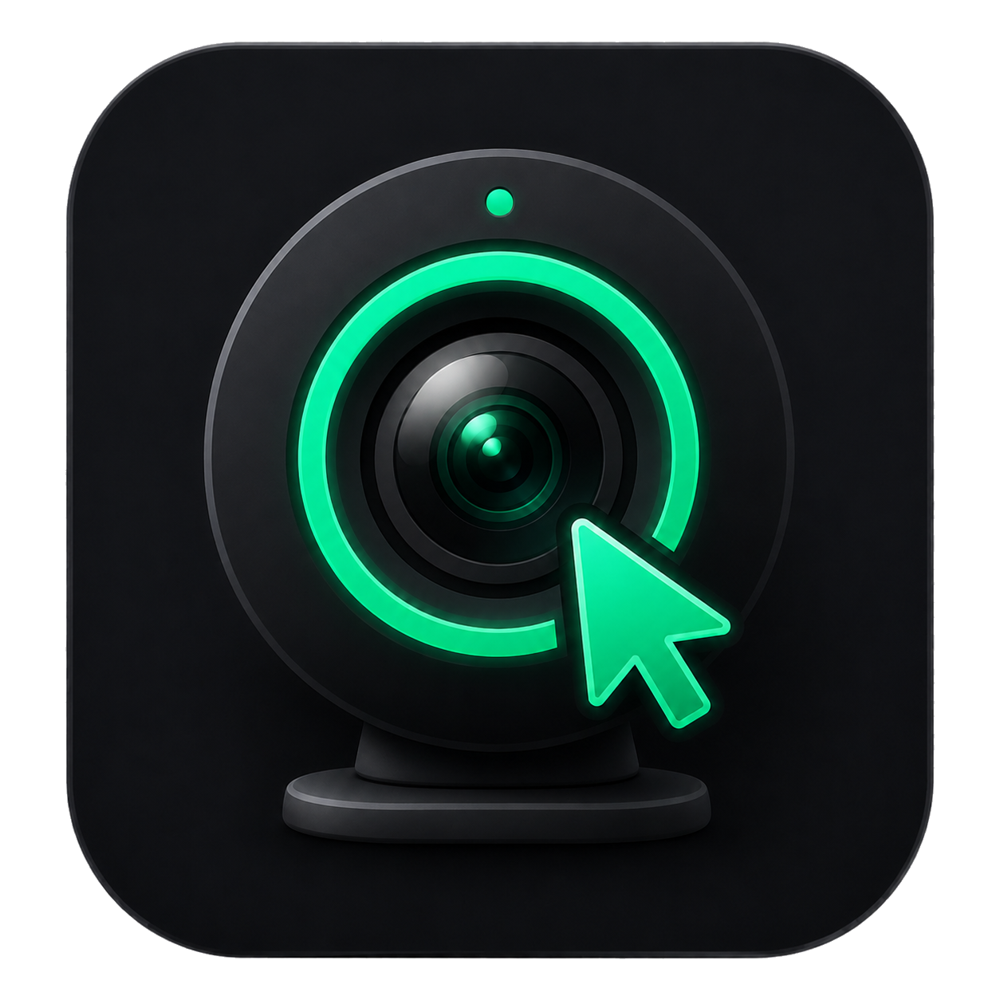
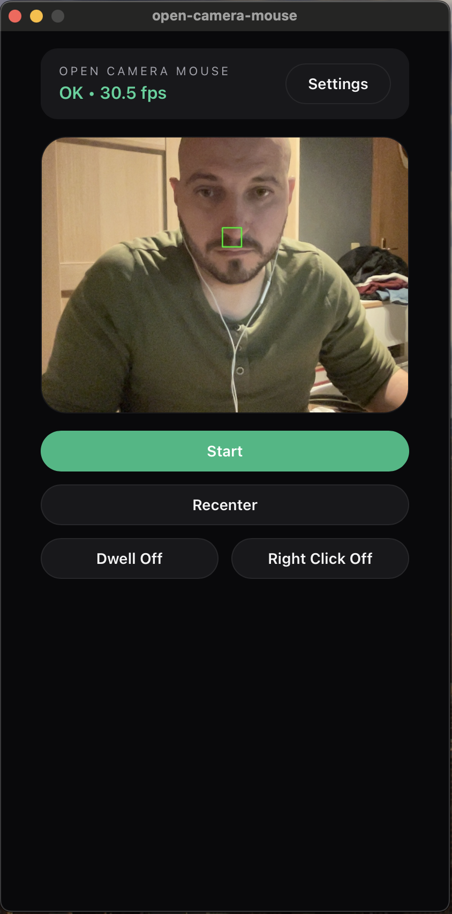

# Open Camera Mouse 

Control your computer cursor with head movements using just a webcam. No special hardware needed.

## Download

Get the latest release for your platform:

- **[macOS](https://github.com/grga1349/open-camera-mouse/releases/latest)** (Apple Silicon)
- **[Windows](https://github.com/grga1349/open-camera-mouse/releases/latest)** (64-bit)

## Installation

### macOS

1. Download `open-camera-mouse_vX.X.X_macOS.zip` from releases
2. Extract and drag `open-camera-mouse.app` to Applications
3. Launch from Applications or Spotlight

**Note:** On first launch, you may need to right-click → Open to bypass Gatekeeper (unsigned application).

### Windows

1. Download `open-camera-mouse_vX.X.X_Windows.zip` from releases
2. Extract to a folder
3. Run `open-camera-mouse.exe`

**Note:** Requires [WebView2 Runtime](https://developer.microsoft.com/microsoft-edge/webview2/#download-section) (pre-installed on Windows 11 and most Windows 10 systems).

## Features

- **Head tracking** — Move your cursor by moving your head
- **Dwell clicking** — Hover to click, no physical input needed
- **Adjustable sensitivity** — Fine-tune cursor speed and smoothing
- **Global hotkeys** — F11 to start/stop, F12 to recenter
- **Works in background** — Hotkeys work even when app is minimized

## Quick Start

1. **Launch** the app and click **Start** (or press F11)
2. **Click** on your face in the preview to set the tracking point
3. **Move** your head to control the cursor
4. **Enable Dwell** to click by hovering (optional)

## Settings

One screen, no tabs:

| Setting | Options |
|---------|---------|
| Template size | Tracking template patch size |
| Sensitivity | Gain multiplier, smoothing |
| Dwell time | How long to hold still before a dwell click fires |
| Auto-start | Start tracking automatically on launch |

See [docs/SETTINGS.md](docs/SETTINGS.md) for full details, ranges, and the recenter flow.

## Tips

- **Good lighting** helps tracking accuracy
- **Marker turns red** when tracking is lost — try a larger template size
- **Press F12** to recenter — tracking pauses, position the tracked point in the white box, and it locks in after a short countdown
- **Increase sensitivity** for less head movement, decrease for more precision

## Troubleshooting

| Problem | Solution |
|---------|----------|
| Cursor jumps around | Increase template size, improve lighting |
| Tracking lost frequently | Use a higher contrast point, improve lighting |
| Cursor too fast/slow | Adjust sensitivity in Pointer settings |
| Cursor doesn't move | macOS: Grant Accessibility permissions in System Settings → Privacy & Security |
| Hotkeys don't work | Ensure no other app claims F11/F12 |

## Platforms

| Platform | Status | Notes |
|----------|--------|-------|
| macOS | ✅ | Requires Accessibility permissions for mouse control |
| Windows | ✅ | Tested on Windows 10/11 |
| Linux | ⚠️ | X11 only, requires libx11-dev |

---

## Contributing

See [docs/RUNBOOK.md](docs/RUNBOOK.md) for build setup, dev workflow, and release steps.

## Documentation

- [Architecture & data flow](docs/ARCHITECTURE.md)
- [Full tech stack](docs/STACK.md)
- [CI/CD and release process](docs/CI.md)
- [Dev runbook](docs/RUNBOOK.md)

## License

MIT License. See [LICENSE](LICENSE) for details.
